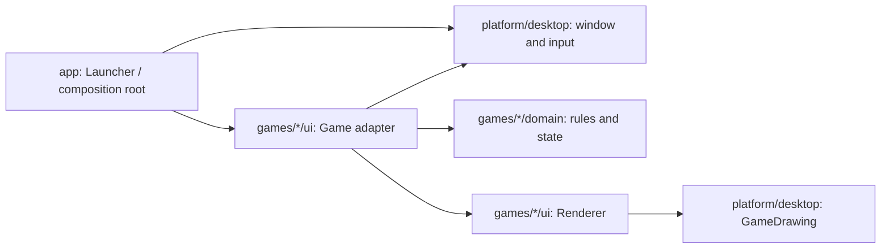

# Архитектурный обзор

Это переработка исходных 25 игр, а не новый набор. Номера, цели, уровни, управление и Swing-графика сохранены. Архитектура организована по предметной области игры, а не по техническим каталогам «все controllers» и «все models».

## Границы и причины изменения

| Компонент | Ответственность | Чего он не знает |
|---|---|---|
| app / Launcher | состав 25 игр, выбор, запуск | алгоритмы конкретной игры |
| DesktopGame | контракт reset/update/input/render | конкретный Swing-компонент |
| GameWindow | создание/закрытие окна | правила игр |
| GamePanel | EDT, ввод, таймер, пауза, обработка ошибки, рисование оболочки | классы конкретных игр |
| GameSession | seed, клавиши, очки и статус одного окна | domain model и каталог приложения |
| `<Subject>Game` | перевод событий в вызовы правил/модели, анимация | детали рисования |
| `<Subject>Renderer` | рисунок из явно переданных значений | контроллер, Random, GameSession |
| domain | правила, контракты, нужные модели состояния | Swing, клавиши, таймер и окно |

Renderer package-private: его API не является публичной библиотекой. Переданные массивы только читаются в течение вызова на EDT, не сохраняются и не возвращаются. Не создаём record-снимок на каждый кадр, чтобы формально изобразить immutability. Там, где данные выходят из доменной модели, снимки действительно независимы.

## Владение и инварианты состояния

**PixelHistory:** владеет массивами снимков; входы и результаты копируются. Новый edit после undo удаляет ветку redo. При заполнении буфера удаляется самый старый снимок, редактирование продолжает работать. Сначала готовится новый снимок, затем меняется история. Это устраняет старое ограничение, когда после примерно 99 правок холст переставал реагировать.

**RobotRunner:** владеет копией карты, программой и immutable ExecutionState. `start` проверяет программу; невалидный ввод не сбрасывает текущий запуск. `step` исполняет ровно одну команду без времени и UI. ExecutionState содержит Cell, направление, индекс следующей команды и флаг исполнения. Интерфейс лишь вызывает step по своему таймеру.

**TileBoard:** владеет полем, создаёт кандидата хода и публикует его только после успешного вычисления. Выбор случайной пустой клетки передаётся отдельной командой, Random не проникает в domain. Snapshot не позволяет изменить модель снаружи. Отказ хода не создаёт новую плитку. Нет каскадного слияния внутри одного хода.

У остальных небольших игр состояние анимации (координаты, текущий ввод, таймер показа) приватно внутри UI-адаптера; чистые правила находятся в domain. Выделять отдельный GameState с десятком getter/setter для каждой из них пока не даёт новой гарантии. При добавлении сохранения, replay или headless engine модель выделяется по конкретному сценарию. Это сознательная граница сложности, а не универсальный шаблон из одинаковых пустых слоёв.

## Именование и повторное использование

`game07.GameLogic` заменён на `edu.course.games.lunartetris.domain.TetrisRules`: имя сообщает предметную область, а методы `canPlace`, `rotateClockwise`, `removeFullRows` — действие. В UI `pieceRow` и `pieceColumn` заменяют px/py, `elapsedSeconds` — clock. Сокращения row/col и x/y остаются у локальных геометрических вычислений. Все 25 классов `*Main` заменены на `*Game`, запуск находится в одном Launcher.main.

Общая платформа содержит только повторно используемую оболочку. Нельзя перемещать туда функции конкретной игры ради устранения двух похожих циклов: независимость учебных задач важнее случайного совпадения реализации. Fixtures зависят только от JDK и подключены лишь там, где используются.

## Модули и JPMS

Maven module — отдельный pom.xml, source roots, зависимости и lifecycle тестов. JPMS module — module-info.java, requires/exports, module path и правила доступа платформы. Здесь 30 Maven projects, включая parent, и нет JPMS descriptors. Сильная инкапсуляция exports, jlink и runtime plugin isolation этому набору пока не нужны; настройка test opens отвлекала бы от тем. Подробности — ADR 001/004/005.

## Исполняемые ограничения

ArchUnit в app/src/test анализирует production bytecode всех модулей: domain не зависит от UI/platform/AWT/Swing; platform не зависит от games/app; разные games независимы; renderers закрыты и не читают контроллер/session; изменяемые поля приватны; static поля final; main только у Launcher. Публичные Jupiter-тесты проверяют правила и новые модели; интеграционные проверки создают все 25 игр на EDT и рисуют их в BufferedImage.

Ограничение проверки: headless lifecycle/render tests не доказывают визуальную красоту или полное прохождение каждой игры. Ручные сценарии для UI указаны в CONTRIBUTING. Пакетирование не выдаётся за тестирование игровых правил.
